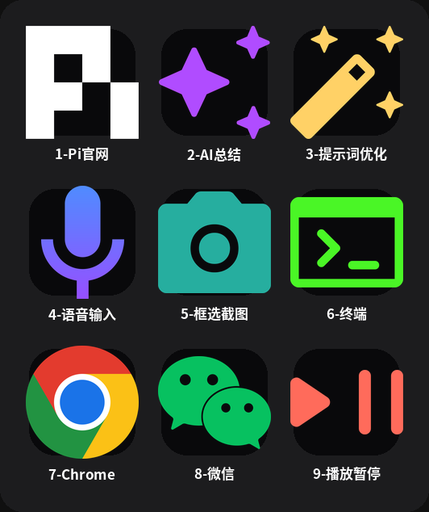
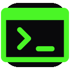

# N3 AI 快捷键包（n3-ai-keys）

把 **Mirabox N3** 控制台变成你的 **Linux 桌面 AI 控制台**：9 个按键 + 3 个旋钮，AI 多模式交互、提示词优化、语音输入、框选截图全部一键完成。基于 [OpenDeck](https://github.com/nekename/OpenDeck) 软件驱动，适用于 Ubuntu（X11/GNOME）桌面。

[](LICENSE)



---

## 功能一览

| 按键 | 图标 | 功能 | 用法 | 依赖 |
| :---: | :---: | --- | --- | --- |
| 1 |  | 打开 Pi 官网 | 按一下，浏览器打开 https://www.pi.dev/ | google-chrome（可选） |
| 2 |  | **AI 智能键**（4 模式循环） | 选中文字后连按，每次不同操作：① 智能分析 → ② 翻译 → ③ 大白话简化 → ④ 提取待办 → 循环… 3 秒无操作自动重置 | DeepSeek API key |
| 3 |  | **提示词优化** | 选中粗糙文字按一下，AI 改写为高质量提示词并粘贴 | DeepSeek API key |
| 4 |  | **语音输入** | 按一下开始录音，再按一下停止，语音自动转文字粘贴 | vocotype + Qwen3-ASR（可选） |
| 5 |  | 框选截图 | 按一下，拖动鼠标框住要截的区域，自动保存并复制 | maim |
| 6 |  | 打开终端 | 按一下打开终端窗口 | gnome-terminal |
| 7 |  | 打开 Chrome | 按一下打开 Chrome 浏览器 | google-chrome（可选） |
| 8 |  | 打开微信 | 已打开则切到微信窗口，没打开则启动 | 微信桌面客户端 |
| 9 |  | 播放/暂停 | 控制当前播放的音乐/视频 | oampris 插件（OpenDeck） |

### 旋钮

| 旋钮 | 功能 | 说明 | 依赖 |
| :---: | --- | --- | --- |
| 1 | 麦克风音量 | 顺/逆时针调 ±5%，按一下静音/取消静音 | pactl（PulseAudio） |
| 2 | 窗口切换 | 顺/逆时针切换窗口，停约 1 秒选定 | xdotool |
| 3 | 系统音量 | 顺/逆时针调 ±5%，按一下静音/取消静音 | pactl（PulseAudio） |

---

## 前提条件

| 需要 | 是什么 | 必须？ |
| ---- | ---- | ---- |
| OpenDeck | 开源 Stream Deck 控制软件（.deb 安装） | ✅ 必须 |
| akp03 插件 | OpenDeck 的 N3 设备驱动（改装版，支持 Mirabox N3，USB 6602:1000） | ✅ 必须 |
| DeepSeek API key | 调用 DeepSeek 大模型用的密钥 | ⚠️ 2/3 号键必须 |
| vocotype + Qwen3-ASR | 本地语音转文字服务 | ⭕ 可选（4 号键用） |

> 本包从一台已经全部调通的 N3 设备导出。安装脚本会自动适配你机器的设备序列号和用户名，不需要手动改任何配置文件。

## 安装（3 步）

1. **装好 OpenDeck 和 akp03 插件**，插上 N3 设备，打开一次 OpenDeck（让软件认识你的设备，会自动创建配置目录）。
2. **运行安装脚本**：打开终端（快捷键 `Ctrl+Alt+T`），进入本包目录后运行：

   ```
   bash install.sh
   ```

3. **填 API key 并重启**：按脚本提示，编辑 `~/.config/streamdock-n3/service.env` 填入你的 DeepSeek key，然后完全退出 OpenDeck（托盘图标右键 → Quit）再重新打开。

安装脚本会自动完成：依赖检查、设备序列号探测、7 个快捷键脚本、3 个提示词风格文件、键位配置（含备份）和 9 个按键图标的安装。

## 提示词风格自定义

3 号键（提示词优化）会按照 `~/.config/streamdock-n3/prompt-style.txt` 里的要求让 AI 改写。包内带了 3 个预设：

| 文件 | 风格 |
| ---- | ---- |
| `prompt-style.txt`（默认，当前生效） | 智能版：简单内容只润色，复杂任务补全结构 |
| `prompt-style-简洁版.txt` | 只润色口语，不加任何标题/列表 |
| `prompt-style-详细版.txt` | 无论什么内容都补全角色、目标、要求、输出格式 |

**换风格方法**：用文本编辑器打开 `prompt-style.txt`，把 `prompt-style-简洁版.txt`（或详细版）里的内容复制进去保存即可。也可以自己写，AI 会按你的要求改写。

## 目录结构

```
n3-ai-keys/
├── install.sh          安装脚本（运行它即可）
├── README.md           本说明文件
├── LICENSE             MIT 许可证
├── assets/             键位预览图（README 头图）
├── scripts/            8 个脚本（n3-common.sh 公共库 + 7 个快捷键脚本）
├── config/             3 个提示词风格预设（AI 改写文字时的要求）
├── icons/              9 个按键图标（1.png ~ 9.png）
└── profile/            OpenDeck 键位配置模板（自动替换用户名）
```

## 卸载方法

运行以下命令，删除安装时写入的全部文件：

```bash
# 1. 删除快捷键脚本
rm -f ~/.local/bin/n3-common.sh ~/.local/bin/n3-ai-paste.sh ~/.local/bin/n3-prompt-paste.sh \
      ~/.local/bin/n3-voice.sh ~/.local/bin/n3-screenshot.sh \
      ~/.local/bin/n3-alttab.sh ~/.local/bin/n3-wechat.sh \
      ~/.local/bin/n3-shot-full.sh

# 2. 删除键位配置和图标（把 n3-MYDEVICE 换成你机器实际的序列号目录名）
rm -rf ~/.config/opendeck/profiles/n3-MYDEVICE
rm -rf ~/.config/opendeck/images/n3-MYDEVICE

# 3. 删除提示词风格配置（可选）
rm -f ~/.config/streamdock-n3/prompt-style*.txt
```

`~/.config/streamdock-n3/service.env`（含你的 API key）建议删除：`rm -f ~/.config/streamdock-n3/service.env`。最后重启 OpenDeck 即可完全恢复原状。

## 电脑重置后一键恢复

如果电脑重装系统或重置，运行一键恢复脚本：

```bash
bash <(curl -s https://raw.githubusercontent.com/jincai822/n3-ai-keys/main/restore.sh)
```

或者先克隆仓库再运行：

```bash
git clone https://github.com/jincai822/n3-ai-keys.git
cd n3-ai-keys
bash restore.sh
```

恢复脚本会自动：安装依赖、配置 udev 规则、克隆仓库、运行安装脚本、提示配置 API key。

## 常见问题

**按键没反应？**
1. 先重启 OpenDeck：托盘图标右键 → Quit → 重新打开。
2. 检查安装时显示的序列号目录，是否和 `~/.config/opendeck/profiles/` 下实际的目录名一致。首次连接设备后目录名 = 设备序列号（形如 `n3-XXXXXXXXXXXX`），如果和你安装时不同，重新运行一次 `bash install.sh`。
3. 2/3/4 号键出错时会弹中文通知说明原因，照着提示处理。

**2 号键（AI 智能键）怎么用？**
选中文字后，连续按 2 号键会循环切换 4 种模式：

| 第几次按 | 模式 | 效果 |
|:---:|:---:|---|
| 第 1 次 | 📊 分析 | AI 自动识别内容类型：文章提炼要点、代码解释逻辑、报错诊断原因、英文翻译成中文等 |
| 第 2 次 | 🌐 翻译 | 翻译成中文（已经是中文就翻译成英文） |
| 第 3 次 | 💡 简化 | 用大白话重写，让小学生也能听懂 |
| 第 4 次 | ✅ 待办 | 提取行动项/待办清单 |
| 第 5 次 | 回到分析 | 循环继续… |

> 3 秒内没有按键会自动重置回「分析」模式，每次选中新文字都从分析开始。

**在终端里使用 2/3 号键要注意什么？**
终端里选中文字后，AI 处理结果不会自动粘贴（因为终端无法可靠替换原文），而是弹出通知显示结果。结果同时已复制到剪贴板，你可以手动按 `Ctrl+Shift+V` 粘贴。

**DeepSeek API key 在哪填？**
编辑 `~/.config/streamdock-n3/service.env`，把 `N3_AI_DECK_API_KEY=` 后面替换成你自己的 key（在 https://platform.deepseek.com/ 申请）。填完保存即可，不用重新安装。

**4 号语音键为什么需要额外安装？**
语音输入要把声音转成文字，本包里的 4 号键只是一个"开始/停止录音"的开关，真正干活的是 vocotype 服务（F9 全局录音 + Qwen3-ASR 本地识别）。安装脚本检测到没装时会提示，但**不会中断安装**，其他按键照常可用。

**1 号键打开的网址能改吗？**
能。在 OpenDeck 界面里打开 1 号键的设置，把命令里的网址换成你想要的即可。

## License

- 本项目的**代码**（安装脚本、快捷键脚本、配置模板）采用 [MIT License](LICENSE)。
- `icons/` 下的图标中，Chrome、微信、Pi 等品牌 logo 版权归各公司所有，本包仅将其作为按键标识使用，请勿用于其他用途；如有疑虑，可以自行替换对应图标文件。
